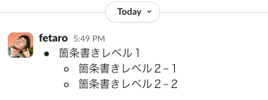
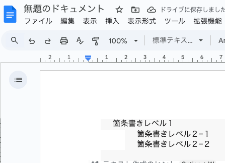
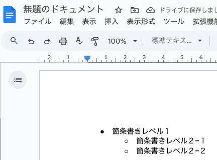

# Slackの箇条書きをGoogle Docsにきれいにコピーできるツール

## 概要

### 解決したい課題
例えばSlackに以下のような箇条書きがあったとしたときに



これをコピーしてGoogle Docsに貼り付けると、



このように、箇条書きの●や◯の記号が消えるし、文字の背景も変な色になる。

### 解決策
このツールを使うことで、以下のようにきれいに貼り付けられる。




## インストール方法

Apple siliconのMacOS(M1,M2など)であれば、MacOS実行ファイル [simplify_clipboard_html](https://raw.githubusercontent.com/fetaro/simplify_clipboard_html/refs/heads/main/simplify_clipboard_html) をダウンロードしてください。

以下のコマンドで実行権限を与えてください。

```
chmod 755 ./simplify_clipboard_html
```

※Apple silicon以外のMacOSでは動作確認していません。自分でビルドをお願いします。

## 使い方

Slackの箇条書きをコピーした状態で、simplify_clipboard_html を以下のように実行してください。

```
./simplify_clipboard_html
```

クリップボードの内容が書き換わり、その後Google Docsにきれいにペーストできます。


## 仕組み

### このツールは何をしているか？

MacOSのクリップボードからHTMLを取得し、HTMLのタグを全部消し、クリップボードにもどしている

### 詳細

まずMacOSのシステムライブラリを使って、クリップボードの中身をHTML形式で取得する。(ちなみに、MacOSにある「pbcopy」コマンドはHTML形式での取得に対応していないため、利用できない)

取得したHTML配下のように色んな属性が入っていて、これがレイアウトを複雑にする原因になっている
```html
<meta charset='utf-8'><ul data-stringify-type="unordered-list" data-list-tree="true" class="p-rich_text_list p-rich_text_list__bullet p-rich_text_list--nested" data-indent="0" data-border="0" style="box-sizing: inherit; margin: 0px 0px 0px 20px; padding: 0px; list-style-type: none; margin-inline-start: 0px; padding-inline-start: 0px; color: rgb(29, 28, 29); font-family: Slack-Lato, Slack-Fractions, appleLogo, sans-serif; font-size: 15px; font-style: normal; font-variant-ligatures: common-ligatures; font-variant-caps: normal; font-weight: 400; letter-spacing: normal; orphans: 2; text-align: left; text-indent: 0px; text-transform: none; widows: 2; word-spacing: 0px; -webkit-text-stroke-width: 0px; white-space: normal; background-color: rgb(255, 255, 255); text-decoration-thickness: initial; text-decoration-style: initial; text-decoration-color: initial;"><li data-stringify-indent="0" data-stringify-border="0" style="box-sizing: inherit; margin-inline-start: 28px; margin-bottom: 0px;">箇条書きレベル１<ul data-stringify-type="unordered-list" data-list-tree="true" class="p-rich_text_list p-rich_text_list__bullet p-rich_text_list--nested" data-indent="1" data-border="0" style="box-sizing: inherit; margin: 0px 0px 0px 20px; padding: 0px; list-style-type: none; margin-inline-start: 0px; padding-inline-start: 0px;"><li data-stringify-indent="1" data-stringify-border="0" style="box-sizing: inherit; margin-inline-start: 28px; margin-bottom: 0px;">箇条書きレベル２−１</li><li data-stringify-indent="1" data-stringify-border="0" style="box-sizing: inherit; margin-inline-start: 28px; margin-bottom: 0px;">箇条書きレベル２−２</li></ul></li></ul>
```

そこでHTMLをパースし、属性を削除し、以下のようなシンプルなHTMLにする

```html
<meta charset="utf-8"/><ul><li>箇条書きレベル１<ul><li>箇条書きレベル２−１</li><li>箇条書きレベル２−２</li></ul></li></ul>
```

その後、クリップボードに書き込む
